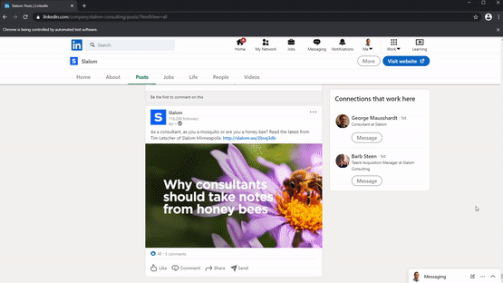
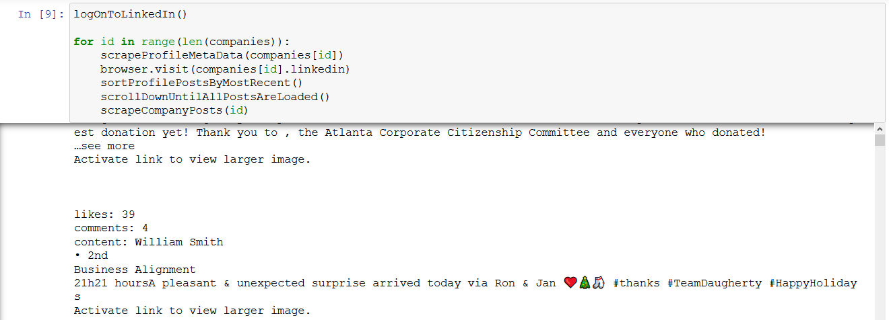
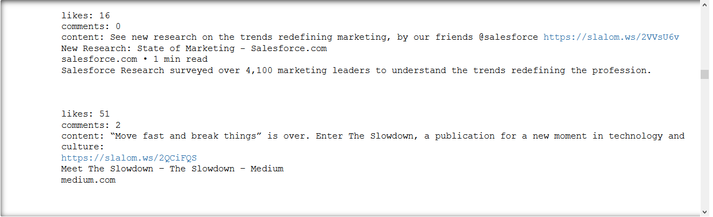
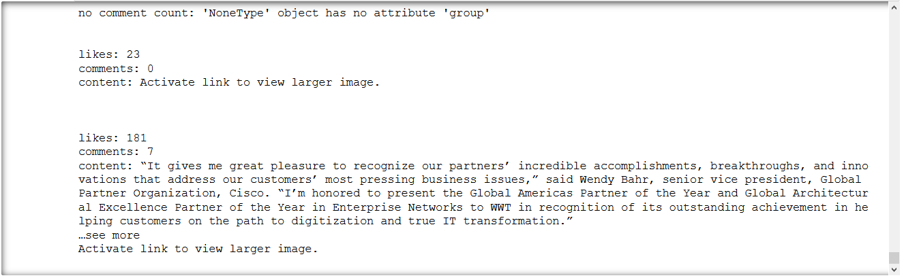
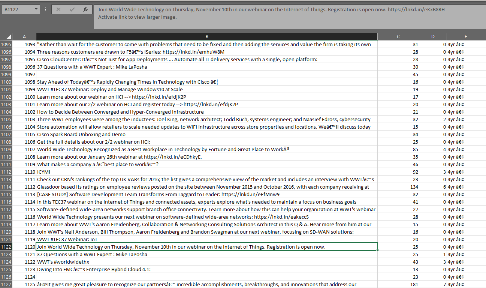

# LinkedIn Scrape (Deprecated)
Bot for scraping LinkedIn profiles. The project was created to extract data on IT consultation companies in the Greater Saint Louis area which could then be compared and analyzed to garner insights. The files in this repository use Daugherty Business Solutions, Slalom, and 1904labs as examples.

*This project is deprecated and will not be getting ongoing support. Considering my experiences with scraping LinkedIn, the scripts will be outdated sooner than later, the website changed its layout twice while developing in just 24 hours! Don't know if that was universal or limited to my experience (for whatever reason).*

# Data Gathered
### Profile Metadata
        # Followers
        # Employees on LinkedIn
### Company Profile Posts
        Content of each post
        # Likes for each post
        # Comments for each post
        # Date post was published in LinkedIn format

Example output can be found in the "data" folder.

# Technologies Used
* Python
* RegEx
* Jupyter Notebook
* Pandas
* Splinter
* chromedriver
* BeautifulSoup4
* pg8000
* PostgreSQL

# Screenshots

# Bot scraping (animated)

# Jupyter Notebook output preview #1

# Jupyter Notebook output preview #2

# Example Profile MetaData CSV

# Example Company Posts CSV
